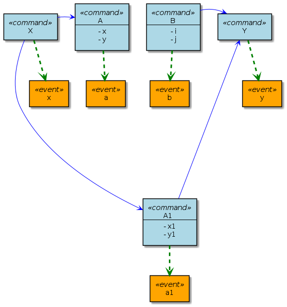

# Event Storming

The tools started as a simple command line tools using plantuml's java library to generate diagrams for Event Storming.  
To make it easier to share with the team, a web UI is developed.  
It works exactly the same way as [plantuml.com](plantuml.com) and it supports not only ```EML``` from [webeventstorming.com](webeventstorming.com) (with addition to support note/comment) but also plantuml code too.

Here's an example of a simple series of commands and events,

```
(UUU) ABC ->
abc

DEF (UUU) ->
def

(UUU) XXX [1234] ->
xxx

[1234] YYY (UUU) ->
yyy

ZZZ (UUU) [1234] ->
zzz
```

A `Command` are suffixed with `->` followed by an `Event` in the next line.
`Command` can be annotated with `Persona` in bracket and/or `User story number` in square bracket.
The above DSL generates this diagram.


To add `Comment` to a `Command` or `Event`, prefix it with `#`

```
ABC ->
# line 1
# line 2
abc
# line a
# line b

DEF ->
deff
```


To show a `Document`, suffix with a `*` and an `Invariant` with a prefix `!`

```
ABC ->
abc
! invariant

DEF ->
def
document*
```


For `External` command, suffixed it with `-*`, instead of `->`

```
A -* // x,y
a

B ->
b
```


To split into 2 timelines, probably base on some invariants to an event, enclose the two deviated timelines with `[]` and separate them with `~`.
Note that the `[]` must be preceded with a `Command` + `Event` and followed with another `Command` + `Event`.

```
X ->
x

[
A -> // x, y
a

B -> // i, j
b

~

A1 -> // x1, y1
a1
]

Y ->
y
```



A more complicated example can be found here,

```
Command ->
# hi there
# what's up?
event
document* //one, two, three

[ branch for if this
ABC ->
abc // apple, orange, banana
! if this
~ branch for if that
FGH ->
fgh // airplane, rocket, ship
! if that
document* //what, is, this
[ nested branch a
Nested ->
nested a
~ nested branch b
Nested ->
nested b
] end nest a or b
XYZ ->
xyz
] end if this or that

Done ->
done
```


Note that:

1. `Command`, `Event` and `Document` can have fields, it's denoted by appending the comma-separated field names prefixed with `//` to the `Command`, `Event` or `Document`.
2. The text following `[`, `~` and `]` is shown over the arrow and is optional.